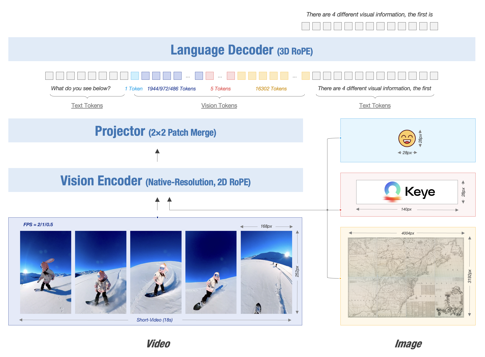
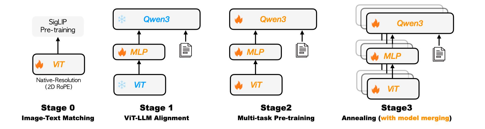
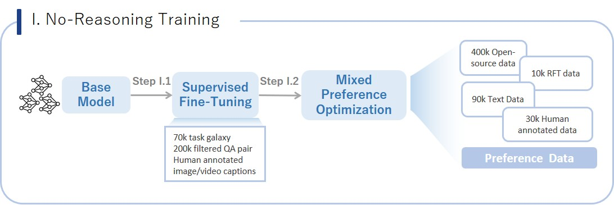
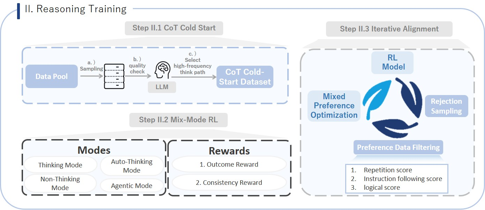

# Kwai Keye-VL


<div align="center">
  
</div>

<font size=7><div align='center' >  [[🍎 Home Page](https://kwai-keye.github.io/)] [[📖 Technical Report]()] [[📊 Models](https://huggingface.co/Kwai-Keye)] </div></font>


## 🔥 News
* **`2025.06.26`** 🌟 We are very proud to launch **Kwai Keye-VL**, a cutting-edge multimodal large language model meticulously crafted by the **Foundational Large Model Team** at [Kuaishou](https://www.kuaishou.com/). As a cornerstone AI product within Kuaishou's advanced technology ecosystem, Keye excels in video understanding, visual perception, and reasoning tasks, setting new benchmarks in performance. Our team is working tirelessly to push the boundaries of what's possible, so stay tuned for more exciting updates!


<div align="center">
  
</div>

## Contents <!-- omit in toc -->

- [🔥 News](#-news)
- [👀 Architecture and Training Strategy](#-architecture-and-training-strategy)
  - [🌟 Pre-Train](#-pre-train)
  - [🌟 Post-Train](#-post-train)
- [📈 Experimental Results](#-experimental-results)
- [✒️ Citation](#️-citation)

## 👀 Architecture and Training Strategy

The model architecture of Kwai Keye-VL is based on the Qwen3-8B language model and incorporates a VisionEncoder initialized with open-source SigLIP. Kwai Keye supports native dynamic resolution, preserving the original aspect ratio of images as much as possible by dividing each image into a sequence of 14x14 patches. Subsequently, a simple MLP layer maps and merges the visual tokens. The model employs 3D RoPE (Rotary Position Embedding) as the position encoding to achieve unified processing of text, image, and video information, establishing a one-to-one correspondence between position encoding and absolute time to ensure the model accurately perceives temporal changes in video information.

<div align="center">
  
  <i> The Kwai Keye-VL model architecture is based on the Qwen3-8B language model and incorporates a vision encoder initialized from the open-source SigLIP. It supports native dynamic resolution, preserving the original aspect ratio of images by dividing each into a 14x14 patch sequence. A simple MLP layer then maps and merges the visual tokens. The model uses 3D RoPE for unified processing of text, image, and video information, establishing a one-to-one correspondence between position encoding and absolute time to ensure precise perception of temporal changes in video information.</i>
</div>


### 🌟 Pre-Train

<div align="center">
  
  <i>The Kwai Keye pre-training pipeline, featuring a four-stage progressive strategy: Image-Text Matching, ViT-LLM Alignment, Multi-task Pre-training, and Annealing with model merging.</i>
</div>
<details>
  <summary>More Details</summary>

  #### Pre-training Data: Massive, High-Quality, Diverse

  - **Diversity**: Includes image-text pairs, videos, pure text, etc., with tasks such as fine-grained description, OCR, Q&A, localization, and more.
  - **High Quality**: Data is filtered using CLIP scores and VLM discriminators, and MinHASH is used for deduplication to prevent data leakage.
  - **Self-Built Datasets**: High-quality internal datasets are specifically constructed, especially for detailed captions and Chinese OCR, to compensate for the shortcomings of open-source data.

  #### Training Process: Four-Stage Progressive Optimization
  Kwai Keye-VL adopts a four-stage progressive training strategy:

  - **Stage 0 (Visual Pre-training)**: Continuously pre-trains the visual encoder to adapt to internal data distribution and support dynamic resolution.
  - **Stage 1 (Cross-Modal Alignment)**: Freezes the backbone model and trains only the MLP to establish robust image-text alignment at low cost.
  - **Stage 2 (Multi-Task Pre-training)**: Unlocks all parameters to comprehensively enhance the model's visual understanding capabilities.
  - **Stage 3 (Annealing Training)**: Fine-tunes with high-quality data to further improve the model's fine-grained understanding capabilities.

  Finally, Kwai Keye-VL explores isomorphic heterogeneous fusion technology by averaging parameters of annealed training models with different data ratios, reducing model bias while retaining multidimensional capabilities, thereby enhancing the model's robustness.

</details>


### 🌟 Post-Train

The post-training phase of Kwai Keye is meticulously designed into two phases with five stages, aiming to comprehensively enhance the model's performance, especially its reasoning ability in complex tasks. This is a key breakthrough for achieving advanced cognitive functions.

#### Stage I. No-Reasoning Training: Strengthening Basic Performance

<div align="center">
  
  <i>This phase focuses on the model's basic performance and stability in non-reasoning scenarios.</i>
</div>

<details>
  <summary>More Details</summary>

- **Stage II.1: Supervised Fine-Tuning (SFT)**
  - Data Composition: Includes 5 million multimodal data, built on a diverse task classification system (70,000 tasks) using the self-developed TaskGalaxy framework. High-difficulty data is selected by multimodal large models and manually annotated to ensure data quality and challenge.

- **Stage II.2: Mixed Preference Optimization (MPO)**
  - Data Composition: Comprises open-source data and pure text preference data. Bad cases from the SFT model are used as quality prompts, and preference data is generated through rejection sampling using Qwen2.5VL 72B and SFT models, with manual scoring and ranking.

</details>

#### Stage II. Reasoning Training: Core Breakthrough for Complex Cognition

<div align="center">
  
  <br>
  <i>This phase is the highlight and major contribution of the Kwai Keye training process. By introducing a mix-mode Chain of Thought (CoT) and multi-thinking mode reinforcement learning (RL) mechanisms, it significantly enhances the model's multimodal perception, reasoning, and think-with-image capabilities, enabling it to handle more complex, multi-step tasks.</i>
</div>

<details>
  <summary>More Details</summary>

- **Step II.1: CoT Cold-Start**
  - Objective: Cold-start the model's chain of thought reasoning ability, allowing it to mimic human step-by-step thinking.
  - Data Composition: Combines non-reasoning data (330,000), reasoning data (230,000), auto-reasoning data (20,000), and agentic reasoning data (100,000) to teach the model different modes.
    - Thinking Data: Focuses on high-difficulty perception and reasoning scenarios like math, science, charts, complex Chinese, and OCR, using multimodal large models for multiple sampling and evaluation to build over 70,000 complex thought chain data.
    - Pure Text Data: Constructs a pure text long thought chain dataset from dimensions like code, math, science, instruction following, and general reasoning tasks.
    - Auto-Think Data: Automatically selects "think" or "no_think" modes based on the complexity of prompts, enabling adaptive reasoning mode switching.
    - Think with Image Data: 100,000 agent data entries, asking Qwen 2.5 VL-72B if image operations (e.g., cropping, rotating, enhancing contrast) are needed to simplify problems or improve answer quality, combined with external sandbox code execution to empower the model to solve problems by writing code to manipulate images or perform mathematical calculations.
  - Training Strategy: Trains with a mix of four modes to achieve cold-start in different reasoning modes.
- **Step II.2: CoT-Mix RL**
  - Objective: Deeply optimize the model's comprehensive abilities in multimodal perception, reasoning, pure text math, short video understanding, and agentic tasks through reinforcement learning based on the chain of thought, making the reasoning process more robust and efficient.
  - Data Composition: Covers complex tasks from multimodal perception (complex text recognition, object counting), multimodal reasoning, high-difficulty math problems, short video content understanding to Think with Image.
  - Training Strategy: Uses a mix-mode GRPO algorithm for reinforcement learning, where reward signals evaluate both the correctness of results and the consistency of the process and results, ensuring synchronized optimization of reasoning processes and final outcomes.
- **Step II.2: Iterative Alignment**
  - Objective: Address common issues like repetitive crashes and poor logic in model-generated content, and enable spontaneous reasoning mode selection to enhance final performance and stability.
  - Data Composition: Constructs preference data through Rejection Fine-Tuning (RFT), combining rule-based scoring (judging repetition, instruction following, etc.) and model scoring (cognitive scores provided by large models) to rank various model responses, building a high-quality preference dataset.
  - Training Strategy: Multi-round iterative optimization with the constructed "good/bad" preference data pairs through the MPO algorithm. This aims to correct model generation flaws and ultimately enable it to intelligently and adaptively choose whether to activate deep reasoning modes based on problem complexity.

</details>

## 📈 Experimental Results


1. Keye-VL-8B establishes itself with powerful, state-of-the-art perceptual abilities that are competitive with leading models. 
2. Keye-VL-8B demonstrates exceptional proficiency in video understanding. Across a comprehensive suite of authoritative public video benchmarks, including Video-MME, Video-MMMU, TempCompass, LongVideoBench, and MMVU, the model's performance significantly surpasses that of other top-tier models of a comparable size.
3. In evaluation sets that require complex logical reasoning and mathematical problem-solving, such as WeMath, MathVerse, and LogicVista, Kwai Keye-VL-8B displays a strong performance curve. This highlights its advanced capacity for logical deduction and solving complex quantitative problems.


## ✒️ Citation

If you find our work helpful for your research, please consider citing our work.   

```bibtex

```
